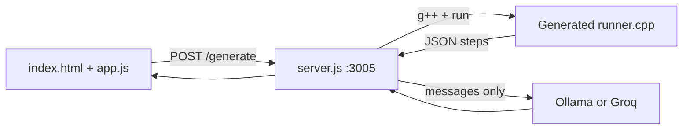
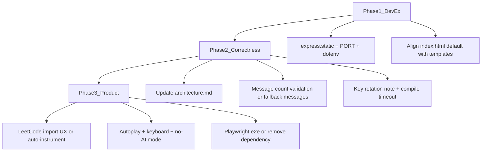

# DSA LC Visualizer — Next Steps and Pending Work

## Current state (what works)



- **Working:** Templates for monotonic stack, tree preorder, grid DFS, linked-list reverse; step-by-step UI for array/stack/queue/deque, tree, grid, list.
- **Recently fixed:** `app.js` templates syntax, `GROQ_API_KEY` via env, `buildTree()` return, [README.md](README.md), [.gitignore](.gitignore).

## Pending issues (fix soon)

### 1. Developer experience — single command to run

Today you must run `npm start` **and** open [index.html](index.html) separately. [server.js](server.js) has no `express.static`, so there is no one URL for the app.

**Recommendation:** Serve the frontend from Express:

```js
app.use(express.static(__dirname));
```

Then document: open `http://localhost:3005` only.

Also add:

- `PORT` from `process.env` (default `3005`)
- `listen` error handler for `EADDRINUSE` with a clear message
- Optional `dotenv` load at top of [server.js](server.js) so `.env` works without manual `export`

### 2. Stale default code in [index.html](index.html)

The textarea default (lines 38–52) still shows an **old API** (`VisualizerStack&`, `stack.pop()` return value, `stack.resolve` on stack). Templates in [app.js](app.js) use the real SDK (`compare`, `resolve`, `st.top()` then `st.pop()`). On load, `algoSelect.dispatchEvent('change')` overwrites with the NGE template, but anyone who edits before JS loads or copies the HTML default will hit compile errors.

**Recommendation:** Replace the textarea default with the same NGE `class Solution` block from `templates.nge` in [app.js](app.js).

### 3. [architecture.md](architecture.md) is out of date

The doc still describes Layer 1 as “AI translates problem → trace,” but implementation is **C++ instrumentation for trace** + **LLM only for `message` strings**. The JSON schema lists only stack/array actions; the engine also supports `init_tree`, `visit_tree_node`, `init_grid`, `focus_cell`, `init_list`, `focus_node`, etc.

**Recommendation:** Rewrite architecture.md to match the C++-first trace model and document the full action enum used by [app.js](app.js).

### 4. LLM message count vs step count

Init/serialization steps use `"step": 0` (tree nodes, grid cells, `focus_array`). The LLM is asked for one message per object in `rawTrace.steps`, but merging is by array index only:

```499:501:server.js
rawTrace.steps.forEach((step, idx) => {
    step.message = llmOutput.messages[idx] || "Step executed.";
});
```

If the model returns fewer strings than `steps.length`, later steps get generic text; if more, extras are ignored. No validation or retry.

**Recommendation (pick one):**

- Filter steps sent to the LLM to only “animated” actions (exclude `step === 0` init), with matching merge logic; or
- Add post-check: `messages.length === steps.length` or fail with a clear 500; or
- **Fallback:** generate deterministic messages from `action` when LLM fails (no API required for demos).

### 5. Security follow-up

- **Rotate Groq key** if the repo was ever pushed with the old hardcoded key (still in git history even after env change).
- User-submitted C++ is compiled and executed via `execSync` on the host — acceptable for local learning tool, but document risk in README; later: timeout, temp dir, resource limits.

### 6. Dead / unused artifacts

| Item | Status |
|------|--------|
| [data.js](data.js) | Static sample trace; not imported by [index.html](index.html) — remove or wire as “demo without backend” |
| `playwright` in [package.json](package.json) | Unused — remove or add e2e test for Generate + step player |
| [test_llm_speed.js](test_llm_speed.js) | Dev-only benchmark; fine to keep, document in README |

---

## Product gaps (medium priority)

### LeetCode import is incomplete

[`POST /leetcode`](server.js) fetches raw C++ + first example testcase. It does **not** instrument code with `compare` / `resolve` / `visit` / etc. Imported problems will compile but produce **empty or minimal traces** unless the user rewrites the solution.

**Next steps (choose depth):**

- **Light:** Stronger UI copy + link to SDK table in README after import.
- **Medium:** Heuristic post-processor (detect `stack<int>`, suggest `compare`/`resolve` in comments).
- **Heavy:** LLM pass to rewrite LeetCode stub into instrumented template (conflicts with “deterministic trace from C++” unless validated by compile).

### C++ entrypoint detection is fragile

Function name detection in [server.js](server.js) (~lines 78–106) uses regex for single-parameter signatures. Breaks on: multi-arg methods, `string`, custom types, static methods, problems named differently than `Solution`.

**Recommendation:** Allow optional `// VISUALIZER_ENTRY: methodName` comment in user code, or explicit function picker in UI.

### Player UX

Missing features users often expect:

- Auto-play / pause and speed control
- Keyboard shortcuts (←/→)
- Progress scrubber on step timeline
- “Run without AI” for faster iteration when Ollama/Groq unavailable

### More problem types

Not yet visualized: hash maps, heaps, graphs (adjacency), two pointers as first-class actions (only via array focus today).

---

## Suggested implementation order



| Phase | Effort | Impact |
|-------|--------|--------|
| **1 — DevEx** | ~1–2 hrs | One URL, fewer port/env surprises |
| **2 — Correctness & docs** | ~2–4 hrs | Fewer confused users, reliable commentary |
| **3 — Product** | Days+ | LeetCode-ready workflow, nicer learning UX |

---

## What you can do right now (no code changes)

1. `export GROQ_API_KEY=...` (or Ollama with `llama3` running).
2. `npm start` in a dedicated terminal; use **Ctrl+C** before restarting to avoid `EADDRINUSE`.
3. Use **templates** (not raw LeetCode code) for reliable traces until import/instrumentation improves.
4. Rotate Groq API key if the project was shared publicly.

No git commit or PR is required for the app to function locally; a commit would mainly help if you want to publish the repo with the fixes already made (env vars, README, `.gitignore`).
