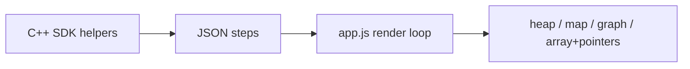

# New Visualizers: Heap, Hash Map, Graph, Two Pointers

## Context

- **Groq key:** You rotated it — no code change required. Update [README.md](README.md) security note to past tense (“rotate if exposed”) so it does not imply an open action item.
- **LLM:** Still optional (`Skip AI` + `messageFromAction`). New actions get entries in `messageFromAction()` in [server.js](server.js).
- **Pattern to extend:** Same as stack/tree/grid/list — instrumented C++ emits JSON `steps`; [app.js](app.js) simulates state up to `currentStep` and renders DOM/SVG.



---

## 1. New trace actions (contract)

Add to [architecture.md](architecture.md) and implement in server + client:

| Visualizer | New actions | Key fields |
|------------|-------------|------------|
| **Heap** | `init_heap`, `push_heap`, `pop_heap` | `index`, `value` (array index stored in heap, value from `global_nums`) |
| **Hash map** | `init_map`, `map_put`, `map_get`, `map_erase` | `key`, `value`, `found` (bool for get) |
| **Graph** | `init_graph`, `graph_edge`, `visit_graph_node`, `focus_edge` | `nodeCount`, `from`, `to`, `nodeId`, `val` |
| **Two pointers** | `focus_pointer` | `label` (`left` / `right` / custom), `index`, `value` |

All init/serialization steps use `"step": 0` like existing tree/grid/list.

---

## 2. C++ sandbox ([server.js](server.js))

Extend the generated `runner.cpp` template (inside the `cppCode` string):

### Heap
- `#include <queue>` already present; add `VisualizerPriorityQueue` wrapping `priority_queue<pair<int,int>>` (index + priority value) or `priority_queue<int>` storing indices.
- Emit `push_heap` / `pop_heap` on push/pop.
- Optional `#define priority_queue VisualizerPriorityQueue` is fragile (template args); prefer explicit type alias in docs: `VisualizerPriorityQueue<int> pq;` or wrap only `priority_queue<int>`.

### Hash map
- `VisualizerMap` wrapping `unordered_map<int,int>`.
- Methods: `put(k,v)`, `get(k)` (logs `map_get` with `found`), `erase(k)`.
- On first `put`, emit `init_map`; each op logs with `stepCount++`.

### Graph
- Helpers (no STL graph macro):
  - `void graph_init(int n)` → `init_graph`
  - `void graph_add_edge(int u, int v)` → `graph_edge` (undirected: emit once or twice — pick **undirected, single emit per edge** for clarity)
  - `void visit_graph(int id)` → `visit_graph_node`
  - `void focus_graph_edge(int u, int v)` → `focus_edge`
- In `main()`, when `is_graph_problem`:
  - Parse edges from request (see §4).
  - Call `graph_init(n)` then `graph_add_edge` for each pair before user `callStatement`.

### Two pointers
- No new struct:
  - `void focus_pointer(const string& label, int idx)` → logs `focus_pointer` using `global_nums[idx]` for `value`.
- Reuses existing `nums` / array panel.

### Detection flags in `/generate`
Extend request body and `main()` booleans:

```js
const isGraphProblem = isGraph || code.includes('VISUALIZER_GRAPH');
const isHeapProblem = code.includes('VisualizerPriorityQueue') || code.includes('priority_queue<');
const isMapProblem = code.includes('VisualizerMap') || code.includes('unordered_map');
// two-pointer: no flag — detected from steps containing focus_pointer
```

Add optional `graphNodes` in POST body (default: `maxVertex + 1` from edges).

### `messageFromAction`
Add cases for all new actions in [server.js](server.js) (~lines 31–80).

---

## 3. Request / input parsing ([app.js](app.js))

| Mode | Test input format | POST fields |
|------|-------------------|-------------|
| 1D array | `4, 2, 5` (unchanged) | `array`, `is2D: false` |
| Graph | `[[0,1],[1,2],[0,2]]` or `3; 0,1; 1,2; 0,2` | `array` as edge list, `isGraph: true`, `graphNodes: 3` |
| Heap / map | Same 1D array as values | unchanged |

Parser logic in generate handler:
- If parsed `array[0]` is an array of two numbers → `isGraph = true`, flatten edges, compute `graphNodes` if omitted.

---

## 4. UI panels ([index.html](index.html) + [styles.css](styles.css) + [app.js](app.js))

### New sections in HTML
- `#heap-section` — `#heap-container` (vertical list, top = heap top highlighted)
- `#map-section` — `#map-container` (key → value chips, highlight on last put/get)
- `#graph-section` — `#graph-container` (SVG nodes + edges, reuse tree layout pattern from [app.js](app.js) tree code ~340–336)

### `render()` updates
- Detect: `isHeapProblem`, `isMapProblem`, `isGraphProblem`, `hasPointers` (any `focus_pointer` step).
- **Panel visibility** (extend existing mutual-exclusion block ~lines 135–180):
  - Graph / list / grid: keep current priority.
  - Heap + map: show alongside **array** when relevant (e.g. two-sum uses array + map).
  - Two pointers: keep **array-section** visible; render `left`/`right` badges above indices (reuse list pointer badge CSS).
- **State simulation loop:** apply new actions to in-memory `heap[]`, `map{}`, `visitedGraphNodes`, `pointerLabels{}`, `focusedEdge`.

### Graph layout
- Circular layout: place `nodeCount` nodes on a circle; draw edges from `graph_edge` steps; highlight `visit_graph_node` and transient `focus_edge`.
- Simpler than force-directed; sufficient for templates (BFS on 4–5 nodes).

---

## 5. Templates ([app.js](app.js) `templates` + [index.html](index.html) `<select>`)

Add four options with instrumented `class Solution` code:

| Template | Demonstrates |
|----------|----------------|
| `heap_top_k` | Push indices into `VisualizerPriorityQueue`, pop k times |
| `hashmap_two_sum` | `map_put` / `map_get` while scanning `nums` |
| `graph_bfs` | `visit_graph` + queue (existing `VisualizerQueue`) on adjacency built via `graph_add_edge` in template or pre-built in main |
| `twopointer_container` | Sorted array, `focus_pointer("left", i)` / `focus_pointer("right", j)` while shrinking window |

Each template includes a working test input in the dropdown `change` handler.

---

## 6. LeetCode hints ([app.js](app.js) `sdkHintsForCode`)

Extend hints when imported code contains:
- `priority_queue` → heap SDK
- `unordered_map` / `map<` → map SDK
- `vector<vector<int>>` adjacency or `VISUALIZER_GRAPH` → graph helpers
- Two-pointer patterns → `focus_pointer` (heuristic: `left`/`right` variable names optional)

---

## 7. Documentation

- [architecture.md](architecture.md): new action rows in enum table.
- [README.md](README.md): SDK table rows for heap/map/graph/pointers; graph input format example; security note for rotated key.

---

## 8. Testing checklist (manual)

1. `npm run check` — syntax on `server.js` / `app.js`.
2. `npm start` → http://localhost:3005.
3. Each new template: **Generate** with **Skip AI** on; step through with keyboard/autoplay.
4. Graph template with edge JSON input.
5. Demo trace unchanged (stack-only `DEMO_TRACE`).

---

## Scope boundaries (not in this phase)

- LeetCode auto-instrumentation (still manual SDK).
- `unordered_map<string,…>` / weighted graphs.
- Extracting `runner.cpp` to a separate file (optional follow-up if `server.js` exceeds ~700 lines).

---

## File touch list

| File | Changes |
|------|---------|
| [server.js](server.js) | C++ classes/helpers, graph main init, flags, `messageFromAction`, accept `isGraph`/`graphNodes` |
| [app.js](app.js) | Parse graph input, render panels, templates, hints, generate POST body |
| [index.html](index.html) | 3 new sections + 4 template options |
| [styles.css](styles.css) | heap/map/graph/pointer badge styles |
| [architecture.md](architecture.md) | Action enum |
| [README.md](README.md) | SDK + graph input + security note |
