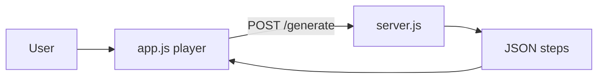

# Product Polish — Next Steps

## Where you are now

Completed: single-command app (`[server.js](server.js)` + static UI), 9 instrumented templates, heap/map/graph/two-pointer panels, skip-AI, keyboard + autoplay, LeetCode import **with manual SDK** (`[README.md](README.md)`).




Biggest **product** gaps (your priority): learning flow stops at linear Prev/Next, one testcase at a time, limited template library.

---

## Phase 1 — Step scrubber and timeline (high impact, ~half day)

**Goal:** Jump to any step without hammering Next; see which steps exist at a glance.

**Changes in** `[index.html](index.html)` + `[app.js](app.js)` + `[styles.css](styles.css)`:

- Add `<input type="range" id="step-slider">` bound to `currentStep` (0 … `steps.length`), synced with Prev/Next and autoplay.
- Optional compact **step list** (first N steps or collapsible): show `action` + short label from `message` or `messageFromAction` logic mirrored in JS (read-only helper, do not duplicate full server switch).
- On slider `input`, set `currentStep` and call `render()`; stop autoplay when scrubbing.
- Keyboard: `Home` / `End` for first/last step (when focus not in textarea).

**No backend changes.**

---

## Phase 2 — Multi-testcase runner (~1 day)

**Goal:** Run the same instrumented solution on example 1, example 2, custom input without re-clicking Generate from scratch each time.

**UI** (`[index.html](index.html)`):

- "Test cases" area: textarea with one input per line (or numbered blocks), e.g.:
  ```
  4, 2, 5, 1, 8
  1, 2
  [[0,1],[1,2]]
  ```
- Dropdown or tabs: **Case 1 / Case 2 / …** after batch run.
- "Run all cases" button (optional progress: Case 2/3…).

**Client logic** (`[app.js](app.js)`):

- Reuse existing `[parseTestInput()](app.js)` per line/block.
- Loop `POST /generate` with `noAI: true` by default for speed; store `testCaseResults[] = { label, input, trace }`.
- Switching case updates `animationData` and resets `currentStep`.

**Optional light API** (`[server.js](server.js)`) — only if batch feels too slow:

- `POST /generate/batch` accepting `{ code, cases: [{ array, isGraph?, ... }] }` — compile **once**, run binary multiple times with different injected inputs. Defer unless single-compile refactor is already planned; client loop is fine for v1.

---

## Phase 3 — More templates (~1 day)

Add 2–3 templates in `[app.js](app.js)` `templates` + `[index.html](index.html)` `<select>`:


| Template               | Why                         | SDK                                      |
| ---------------------- | --------------------------- | ---------------------------------------- |
| **Binary search**      | Classic two-pointer variant | `focus_pointer("mid", m)`, `focus_array` |
| **Sliding window max** | deque already instrumented  | `deque`, `focus_pointer("left"/"right")` |
| **Valid parentheses**  | Stack-only, easy win        | `stack`, `compare` optional              |


Each needs a working test input and **Skip AI**-friendly traces (verify with `npm run check` + manual Generate).

**Graph template improvement (small):** Refactor `[graph_bfs](app.js)` to build `adj` from `graphEdges` in trace / documented edge list instead of hardcoded 4-node graph — aligns input with visualization.

---

## Phase 4 — Small UX wins (quick, optional same PR)

- **Remember preferences:** `localStorage` for skip-AI checkbox and autoplay speed.
- **Export trace:** "Download JSON" button → `latest_trace.json`-shaped blob for sharing/debugging.
- **Empty-state copy:** Point new users to **Load demo trace** then a template.

---

## Out of scope for this phase (later)

- LeetCode auto-instrumentation (still manual SDK)
- Automated E2E / Playwright CI
- Extracting C++ sandbox out of `[server.js](server.js)` (~800+ lines)
- Public deploy / Docker (separate "ship" track)

---

## Suggested order

1. Step scrubber (immediate feel of a "real" player)
2. Multi-testcase (matches how people use LeetCode examples)
3. New templates + graph template fix
4. localStorage + export trace if time remains

## Verification

- `npm run check`
- Manual: each new template with Skip AI; scrubber at step 0, middle, end; 2+ test cases on NGE and Two Sum; graph case with `[[0,1],[1,2]]`

