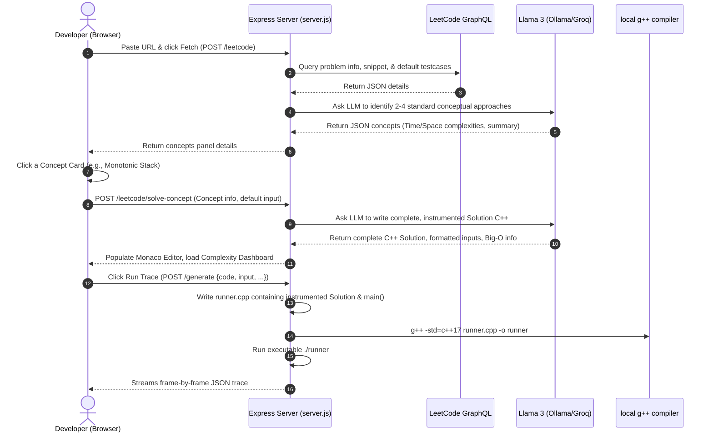

# DSA LC Visualizer — Compiler & UI Architecture

This document describes the data flow, sandbox compiler, tracing macro system, and UI rendering layers of the **DSA LeetCode Visualizer**.

---

## 🏗️ Design Principles

1.  **C++-First Authoritative State**: The authoritative execution trace is produced by compiling and running an instrumented C++ sandbox (`runner.cpp`). The browser never tries to emulate C++ memory or guess algorithm states.
2.  **LLM for Commentary Only**: LLM (Groq/Ollama) is isolated to generating step-by-step beginner-friendly explanations. If the LLM is slow, down, or skipped (`noAI: true`), the browser falls back seamlessly to deterministic actions descriptions generated via `messageFromAction()`.
3.  **Trace correctness is independent of AI**: Code instrumentation uses compile-time macros and templated wrappers. The LLM only injects visual tracking calls (e.g., `focus_pointer`, `compare`, `resolve`), which are validated by `g++` during sandbox execution.

---

## 🔄 Dynamic LeetCode Data Flow



---

## 🔠 String-to-ASCII Trace Engine

For string-based problems (e.g., LeetCode's *Longest Substring Without Repeating Characters*), standard C++ requires compiling real `std::string` data types. However, our browser array visualization is optimized for drawing numerical memory grids. 

To bridge this seamlessly:
1.  **Detection**: The backend analyzes the generated code; if it contains string keywords (e.g., `std::string`, `lengthOfLongestSubstring`), `isStringProblem` is marked `true`.
2.  **ASCII Conversion (Backend)**:
    *   The test case string (e.g. `"abc"`) is parsed.
    *   In the sandboxed `main()` of `runner.cpp`, characters are translated into an integer array using their decimal ASCII representations:
        ```cpp
        vector<int> nums = {97, 98, 99}; // 'a', 'b', 'c'
        vector<string> tree_nodes = {"a", "b", "c"};
        ```
    *   The standard `nums` vector is passed to C++ execution.
3.  **Trace Serialization**: The sandboxed macros (such as `focus_pointer`, `compare`, `resolve`) record indices and integer values.
4.  **Reverse ASCII Mapping (Frontend)**:
    *   `app.js` receives the trace along with `finalTrace.array` mapped as `["a", "b", "c"]`.
    *   When the UI replays the trace steps, any step value (e.g. `97` in `focus_array` or `resolve`) is automatically mapped back to its character equivalent (e.g. `"a"`) for display in the array cells.

---

## 🧾 Extended Trace Action Schema

Traces are serialized as a JSON sequence of frame structures:

```json
{
  "array": ["a", "b", "c"],
  "steps": [
    { "step": 0, "action": "focus_pointer", "label": "right", "index": 0, "value": 97, "message": "Initialized right pointer at 'a'" },
    { "step": 1, "action": "map_put", "key": "a", "val": 0, "message": "Saved index 0 for char 'a'" }
  ]
}
```

### Action Types & Visual Representations

| Action | Target Variable | UI Visual Representation |
| :--- | :--- | :--- |
| `focus_array` | Array cell | Adds `.vis-active` glow to the array cell at `index`. |
| `focus_pointer` | Dual pointers | Renders a small floating badge containing `label` below the cell at `index`. |
| `compare` | Multi-comparison | Highlights both indices (yellow/red flashes) showing structural comparison. |
| `resolve` | Result cell | Adds `.vis-resolved` permanent badge color at `index`. |
| `push_stack` / `pop_stack` | Monotonic Stack | Visualizes standard stack push/pop inside the vertical container. |
| `push_queue` / `pop_queue` | BFS Queue | Shows horizontal push/pop items on queue visualizers. |
| `push_back_deque` / `pop_front_deque` | Monotonic Deque | Animates dual-ended additions and deletions. |
| `map_put` / `map_get` / `map_erase` | Hash Map slots | Draws dynamically shrinking/growing key-value grid boxes. |
| `push_heap` / `pop_heap` | Priority Queue | Triggers heap bubble-up/sift-down visualizations. |
| `visit_tree_node` | Binary Tree | Highlights node and traverses left/right pointers on SVG layouts. |
| `focus_cell` / `update_cell` | 2D Matrix | Animates cellular coordinates inside 2D grid meshes. |
| `focus_node` / `update_next` | Linked List | Draws pointer arrows (`curr`, `prev`) and visualizes node reference modifications. |

---

## 🏗️ C++ Sandbox Inner Mechanics

During `/generate`, user code inside `class Solution` is joined with pre-built scaffolding templates:

```cpp
#include <iostream>
#include <vector>
#include <stack>
#include <queue>
#include <deque>
#include <string>
#include <unordered_map>
#include <algorithm>

using namespace std;

// SDK macros wrap STL containers to automatically emit traces:
#define stack VisualizerStack
#define queue VisualizerQueue
#define deque VisualizerDeque

// Dynamic instrumentation variables injected by runner:
vector<int> global_nums;
...
```

The standard entry point is discovered via regular expressions targeting standard `class Solution` methods. If needed, the entry point can be overridden by adding the comment: `// VISUALIZER_ENTRY: yourCustomMethodName`.

---

## 📈 Big-O Growth Curves Logic

The frontend utilizes dynamic styling and canvas coordinates to map Big-O performance curves based on metadata parsed from the LLM solution. 

```
Complexity category matches -> Applied CSS classes -> Rendered Curve Chart
- O(1) ---------> complexity-constant -------> flat line
- O(log N) -----> complexity-logarithmic ----> sub-linear curve
- O(N) ---------> complexity-linear ---------> straight diagonal
- O(N log N) ---> complexity-linearithmic ---> slightly steeper slope
- O(N^2) -------> complexity-quadratic ------> parabolic curve
- O(2^N) -------> complexity-exponential ----> extreme vertical leap
```

These classes inject tailored CSS variables to generate harmonized visual cues across the editor and concept sheets.
