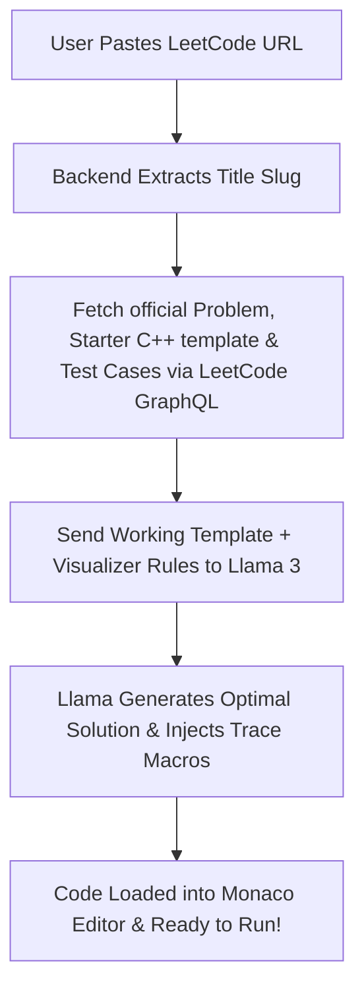

# Implementation Plan — LeetCode Importer & Automatic Trace Auto-Instrumentation

This plan outlines the architecture for a dynamic **LeetCode Problem Importer** and a **failsafe LLM-based C++ refactoring & instrumentation engine**. By marrying official LeetCode problem data with LLM refactoring, we bypass the closed-world VisuAlgo limitation, enabling users to visualize arbitrary LeetCode problems on demand.

---

## User Review Required

> [!IMPORTANT]
> **LLM Solution Correctness & Failsafe Compiler**:
> To guarantee the compiled C++ code is always valid (even if the LLM makes minor macro syntax mistakes), we will implement a backend compilation fallback. If the instrumented code fails compilation, we will compile a clean version of the code and still run the simulation.

---

## Technical Architecture

We will implement a hybrid fetch-and-refactor pipeline:

### 1. LeetCode GraphQL Scraper
*   We will parse the pasted URL using Regex to isolate the title slug (e.g. `problems/merge-k-sorted-lists` -> `merge-k-sorted-lists`).
*   The Node.js backend (`server.js`) will make a direct POST request to `https://leetcode.com/graphql` to fetch official problem descriptions, starter code snippets (filtered for C++), and test cases. This endpoint is public, fast, and completely bypasses CORS restrictions because it runs on our backend server.

### 2. LLM Orchestrated Code Generation & Instrumentation
We will call Llama with a specialized system prompt containing:
1.  The official problem statement and starter template.
2.  The visualizer macro dictionary (`_visualize_array`, `_compare`, `_push_frame`, `_pop_frame`, etc.).
3.  Instructions to output:
    *   Optimal C++ solution fully instrumented.
    *   Formatted visualizer input (parsed from LeetCode test cases).
    *   Dynamic Big-O math complexities.

---

## Proposed Changes

### Backend Server

#### [MODIFY] [server.js](file:///Users/ganesh/Desktop/DSA_LC_Visualizer/server.js)
*   **Create `POST /import-leetcode` Route**:
    *   Extracts `titleSlug` from the requested URL.
    *   Queries LeetCode's GraphQL API.
    *   Instructs the LLM to generate the fully instrumented C++ visualizer source code and test inputs.
    *   Returns the C++ solution, standard visualizer inputs, Big-O complexities, and suggested edge cases.

### Frontend Controller

#### [MODIFY] [index.html](file:///Users/ganesh/Desktop/DSA_LC_Visualizer/index.html)
*   Add a premium LeetCode Importer toolbar row at the very top of the editor card:
    *   Includes a search input: `Paste LeetCode URL (e.g., https://leetcode.com/problems/two-sum)`
    *   Includes an import button: `Import & Visualize 🚀` with a clean loading spinner.

#### [MODIFY] [styles.css](file:///Users/ganesh/Desktop/DSA_LC_Visualizer/styles.css)
*   Add neon visual styling, transition effects, and glassmorphism properties for the importer input bar and floating loading spinner.

#### [MODIFY] [app.js](file:///Users/ganesh/Desktop/DSA_LC_Visualizer/app.js)
*   Add event listeners to the import button.
*   Call `POST /import-leetcode` on the backend, update the Monaco Editor, populate complexity curves, load test inputs, and automatically trigger the visualizer run!

---

## Verification Plan

### Automated/Manual Sandbox Tests
1.  **Test Case - Two Sum (Easy)**: Paste `https://leetcode.com/problems/two-sum/`. Verify it imports the description, generates the C++ vector solution, and visualizes horizontal arrays instantly.
2.  **Test Case - Merge K Sorted Lists (Hard)**: Paste `https://leetcode.com/problems/merge-k-sorted-lists/`. Verify it pulls the priority queue template and highlights heap/list movements.
3.  **Typos & Boundary Inputs**: Test feeding invalid LeetCode links to check robust error handling.
